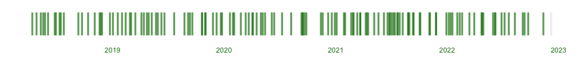

<!-- README.md is generated from README.Rmd. Please edit that file -->

# rostrum-blog

<!-- badges: start -->

<!-- badges: end -->

These are the source files for
[rostrum.blog](https://www.rostrum.blog/), a blog about fun and learning
with the R language. Read more on the
[about](https://www.rostrum.blog/about/) page.

# Stats

There have been 83 posts on the blog since the first one was published
on 2018-04-14.

That’s a post roughly every 13 days, or about 2.3 posts per month.

The latest post was published 18 day(s) ago on on 2021-03-23.

This plot shows posts over time:

Click to expand a full list of posts

| Number | Date       | Title                                             |
| -----: | :--------- | :------------------------------------------------ |
|     83 | 2021-03-23 | Make a {shiny} app README badge                   |
|     82 | 2021-03-23 | Apple Health and Nike Run Club with {xml2}        |
|     81 | 2021-03-13 | Protect yourself from equals assignment\!         |
|     80 | 2021-03-02 | A tiny {shiny} flag challenge                     |
|     79 | 2021-02-27 | Typo-shaming my Git commits                       |
|     78 | 2021-02-21 | \#GithubSkyline but hear me out                   |
|     77 | 2021-02-02 | What does a year of COVID-19 sound like?          |
|     76 | 2021-01-28 | R’s names and values as anchovy pizza             |
|     75 | 2021-01-04 | Play Pokémon’s Safari Zone in R                   |
|     74 | 2020-12-30 | Accessible colour contrasts with {coloratio}      |
|     73 | 2020-12-20 | Mapping londonmapbot tweets with {leaflet}        |
|     72 | 2020-12-08 | Sending {postcards} with Netlify and Namecheap    |
|     71 | 2020-11-21 | The US electoral college with {tilegramsR}        |
|     70 | 2020-11-14 | Translate R to English with {r2eng}               |
|     69 | 2020-09-27 | Hit your reproducibility {targets}                |
|     68 | 2020-09-21 | A Twitter bot with {rtweet} and GitHub Actions    |
|     67 | 2020-09-16 | Friendship ended with Google Analytics            |
|     66 | 2020-09-15 | Rate my RStudio setup                             |
|     65 | 2020-09-12 | {units} of uncleaned herring                      |
|     64 | 2020-08-09 | R-Package GitHub Actions via {usethis} and r-lib  |
|     63 | 2020-07-11 | Blogging with R on Raspberry Pi                   |
|     62 | 2020-06-14 | Take a {ghdump} to download GitHub repos          |
|     61 | 2020-06-06 | Animal Crossing Tinder with {shinysense}          |
|     60 | 2020-05-16 | \#PostcodePandemonium with {data.table}           |
|     59 | 2020-05-08 | Make a README badge with {badgr}                  |
|     58 | 2020-05-02 | AGÜEROOOOO with {ggsoccer} and {gganimate}        |
|     57 | 2020-04-17 | Owning the shame of my old R code                 |
|     56 | 2020-04-05 | Plotception with {ggpattern}                      |
|     55 | 2020-04-04 | Repaying Tom Nook with {R6}                       |
|     54 | 2020-03-22 | Ninja scaffolding for {xaringan}                  |
|     53 | 2020-03-12 | Iterate parameterised {xaringan} reports          |
|     52 | 2020-02-27 | Dear past self: blog                              |
|     51 | 2020-02-05 | A Pokémon sprite carousel with {slickR}           |
|     50 | 2020-01-31 | {orderly} and {drake} at Bioinformatics London    |
|     49 | 2020-01-22 | Reproducibility in R: three things                |
|     48 | 2019-12-27 | Packages that Sparked Joy in 2019                 |
|     47 | 2019-12-23 | Handle London travel data with {oystr}            |
|     46 | 2019-12-08 | {altcheckr}: check image alt text from R          |
|     45 | 2019-11-27 | A pivotal change to Software Carpentry            |
|     44 | 2019-11-02 | Tidyswirl: a tidyverse Swirl course               |
|     43 | 2019-11-01 | Build an R package with {usethis}                 |
|     42 | 2019-10-22 | {blogsnip}: an RStudio addin package              |
|     41 | 2019-10-21 | Git going: Git and GitHub                         |
|     40 | 2019-09-20 | How do you pronounce {dplyr}?                     |
|     39 | 2019-09-12 | The Carpentries: teach with live coding           |
|     38 | 2019-09-06 | {blogdown}: add metadata to Lithium-themed posts  |
|     37 | 2019-08-25 | {holepunch} a {drake} and put it in a Binder      |
|     36 | 2019-07-23 | Can {drake} RAP?                                  |
|     35 | 2019-06-20 | The Mountain Goats with {trelliscopejs}           |
|     34 | 2019-06-11 | A GitHub repo template for R analysis             |
|     33 | 2019-05-31 | Make a {brickr} soccer player                     |
|     32 | 2019-05-24 | Package a {xaringan} template                     |
|     31 | 2019-05-10 | Teach a person to {swirl}                         |
|     30 | 2019-04-30 | Markov-chaining my PhD thesis II                  |
|     29 | 2019-04-25 | Generating the Mountain Goats lyrics              |
|     28 | 2019-04-14 | A year of rostrum.blog                            |
|     27 | 2019-04-07 | Fix leaky pipes in R                              |
|     26 | 2019-03-18 | A tidyverse functions quiz with {learnr}          |
|     25 | 2019-03-04 | Web scraping the {polite} way                     |
|     24 | 2019-02-27 | What’s your Hadley Number?                        |
|     23 | 2019-02-14 | Graphing the Relayverse of podcasts               |
|     22 | 2019-02-01 | Git going: the command line                       |
|     21 | 2019-01-18 | Map deer-vehicle colisions with {shiny}           |
|     20 | 2019-01-04 | Motivate yourself with an .Rprofile               |
|     19 | 2018-12-24 | Travel the NBA with {rvest}, {leaflet} and {osrm} |
|     18 | 2018-11-29 | Change your {blogdown} fonts                      |
|     17 | 2018-11-25 | Quantify colour by {magick}                       |
|     16 | 2018-11-21 | Waggle dance with {ggbeeswarm} and {emoGG}        |
|     15 | 2018-11-04 | Teaching R with Pokémon Go data                   |
|     14 | 2018-10-13 | R session info info                               |
|     13 | 2018-09-24 | Knitting Club: R Markdown for beginners           |
|     12 | 2018-09-12 | EARL 2018: {crosstalk} in memes                   |
|     11 | 2018-07-26 | Engifification in R with {gifski}                 |
|     10 | 2018-07-17 | Footballers are younger than you                  |
|      9 | 2018-07-12 | How accessible is my post about accessibility?    |
|      8 | 2018-06-30 | Markov-chaining my PhD thesis                     |
|      7 | 2018-06-26 | Mail merge with R and Dawson’s Creek              |
|      6 | 2018-06-05 | Tid-ye-text with geniusr                          |
|      5 | 2018-05-25 | Cloudy with a chance of pie                       |
|      4 | 2018-05-19 | Pokéballs in Super Smash Bros                     |
|      3 | 2018-05-12 | Accessibility workshop at \#Sprint18              |
|      2 | 2018-04-27 | TWO DOGS IN TOILET ELDERLY LADY INVOLVED          |
|      1 | 2018-04-14 | R Trek: exploring stardates                       |

# Infrastructure

The site is generated with
[{blogdown}](https://bookdown.org/yihui/blogdown/) and uses a customised
version of [the Lithium
theme](https://github.com/jrutheiser/hugo-lithium-theme) modified by
[Yihui Xie](https://github.com/yihui/hugo-lithium-theme). The site is
hosted with [Netlify](https://www.netlify.com/).

-----

*Last updated 2021-04-10*
